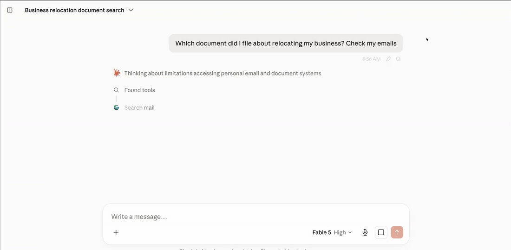

# mailindex-mcp

**A mail client for an AI agent. Everything you can do in Thunderbird — search,
move, mark, delete, draft — over your own index, on your own machine.**

Most email MCP servers forward each question straight to IMAP. That answers "show
me my last 10 messages" and falls apart on everything else: `SEARCH` is
inconsistent between providers, it cannot see inside attachments, it never tells
the model whether it actually searched everything, and it cannot do a thing about
what it finds.

So when you ask an assistant to clear eight thousand newsletters out of your
inbox, it tells you that would be eight thousand tool calls and suggests you go
and do it by hand in the web interface.

This one keeps its own copy of your mail and acts on it:

```
delete_mail(account_id=3, participants=["newsletter@example.com", ...])
→ matched: 4147, affected: 4147, to: "[Google Mail]/Bin"
```

One call. One connection. Six seconds. That is the difference between a search
box and a mail client.



<sub>A real question against a live index of about 59,000 messages across six
accounts. One string is blurred: a case number belonging to a real filing.</sub>

## Why this instead of the other email MCP servers

|  | This project | Typical email MCP |
|---|---|---|
| Can it change anything | Move, mark, delete, draft, manage folders — in bulk, by search | Read-only, or one message per call |
| Search | Own PostgreSQL index, GIN full-text, stemmed across languages | Live IMAP `SEARCH` per call |
| Result completeness | Exact `total_count`, signed cursors, per-account coverage | Whatever the folder returned |
| Attachments | Text extracted and indexed at sync time (PDF, DOCX, XLSX, PPTX, OCR) | Base64 into the model's context, or not at all |
| Attachment binaries | Never stored; refetched through a 5-minute signed URL | Stored on disk or inlined |
| Transport | Remote HTTP endpoint | Local stdio process on your machine |
| Setup on the client | Paste a URL | Install a runtime, edit config JSON, store credentials locally |
| Users | Multi-tenant, every row owner-scoped | Single user |
| Tool surface | 19 tools, all annotated | Frequently 40+ |

**What it costs you, stated up front.** You run PostgreSQL and a container. The
index is about **28 MB per 1,000 messages** — a 50,000-message archive is roughly
1.5 GB — and the image is 1.25 GB because it carries OCR language data. The first
sync downloads every message once; search works on what has arrived while the
rest continues in the background, and each account reports its own coverage so
the model knows what it has not seen yet.

In exchange your assistant can answer questions about mail from years ago,
including text inside attachments, and then act on the answer. None of it leaves
your machine.

## Quickstart

Five minutes, local only, no accounts to create anywhere.

```bash
git clone https://github.com/alexanderkrauck/mailindex-mcp.git
cd mailindex-mcp
cp .env.example .env
docker compose up -d
```

That pulls `ghcr.io/alexanderkrauck/mailindex-mcp` rather than building. Add
`--build` if you would rather compile it yourself; expect several minutes.

Check it came up:

```bash
curl http://localhost:8002/api/v1/health
```

The default `development` mode is **unauthenticated** and Docker binds it to
`127.0.0.1` only. It is meant for exactly this: trying the thing out on your own
machine.

### Connect a mailbox

Use an app password, not your login password. Gmail, Zoho, Fastmail, iCloud and
most other providers issue these in their security settings.

```bash
curl -X POST http://localhost:8002/api/v1/accounts \
  -H 'Content-Type: application/json' \
  -d '{
    "name": "personal",
    "account_name": "you@example.com",
    "username": "you@example.com",
    "password": "your-app-password",
    "host": "imap.example.com",
    "port": 993,
    "smtp_host": "smtp.example.com",
    "smtp_port": 465
  }'
```

Synchronization starts on its own. Watch it fill up:

```bash
docker compose logs -f email-server
```

### Connect your AI client

```bash
claude mcp add --transport http mail http://localhost:8002/mcp
```

For other clients, point them at `http://localhost:8002/mcp` over streamable HTTP.
Then ask something your inbox search would struggle with — a phrase inside a PDF
someone sent you three years ago works well.

## Which setup do I need?

Four ways people arrive at this, and the shortest honest path for each.

### "I want to see if this is real" — 5 minutes, your laptop

Everything runs locally, nothing to sign up for.

```bash
git clone https://github.com/alexanderkrauck/mailindex-mcp.git
cd mailindex-mcp && cp .env.example .env
docker compose up -d          # pulls the published image; add --build to compile it yourself
claude mcp add --transport http mail http://localhost:8002/mcp
```

Add a mailbox with an app password (see below), wait for it to sync, then ask
your client something your inbox search would lose. **What you need:** Docker,
and an app password from your provider. **What to expect:** the first build
compiles psycopg2 and pulls ~130 MB of OCR language data, so it takes minutes,
not seconds. Auth is off and Docker binds to `127.0.0.1` only — fine here,
never expose it.

### "I want this on my phone and laptop, every day" — one person, one server

You need a small VPS and a domain. Caddy gets the TLS certificate for you.

```bash
cat > .env <<'ENV'
EMAILSERVER_DOMAIN=mail.example.com
POSTGRES_PASSWORD=...
EMAILSERVER_API_TOKEN=...
CREDENTIAL_ENCRYPTION_KEY=...
SESSION_SECRET=...
ENV
docker compose -f docker-compose.single-user.yml up -d --build
```

Every value from `openssl rand -base64 32`; the API token must be at least 32
characters or the server refuses to start. **What you need:** a VPS with ~2 GB
RAM and disk for roughly 25 MB per 1,000 messages, a domain, and an app password
per mailbox. **What to expect:** works with anything that sends an
`Authorization` header — Claude Code, Cursor, `mcp-remote`. It will *not* work
with the claude.ai or ChatGPT web connectors, which negotiate OAuth and cannot
send a static token. If you want those, use the next one.

### "My family/team should each have their own" — a few people

Google OAuth, so each person signs in as themselves and sees only their own
mailboxes.

```bash
docker compose -f docker-compose.production.yml up -d --build
```

**What you need:** everything above, plus a Google Cloud OAuth **Web
application** with the two redirect URIs listed under [Deployment
modes](#deployment-modes). **What to expect:** an unverified-app warning until
you submit the consent screen, and a 100-user cap while unverified — neither
matters at this size.

> **Set `REGISTRATION_MODE=allowlist`.** With `open`, any Google account on
> earth can register on your server and attach mailboxes, and
> `ALLOWED_GOOGLE_EMAILS` is never read. Tenant isolation still keeps strangers
> out of *your* mail, but they get an account on your box. This is the easiest
> thing to get wrong on a public host.

### "Could this be internal infrastructure?" — 500-person company

Honestly: not yet, and here is exactly what is missing rather than a maybe.

**What works today.** Run it for one team as a pilot using the Google setup
above. Multi-tenancy is real and enforced at the query level — every row is
owner-scoped, and ownership comes from the authenticated token rather than
anything a caller supplies. Mailbox credentials are encrypted at rest and never
returned. Attachment binaries are never stored.

**What blocks a company-wide rollout.**

| Gap | Why it matters |
|---|---|
| Login is Google OIDC only | No Entra ID, Okta, generic OIDC or SAML. If your directory is not Google, nobody can sign in. |
| No provisioning or deprovisioning | Users self-register; there is no SCIM, no group mapping, and no way to revoke someone's index when they leave. |
| No audit export | Sends are audited; reads, searches and mailbox writes are not, which most compliance reviews ask about. |
| Single Postgres, single container | No HA, no read replicas, no horizontal sync workers. Backup and restore is your `pg_dump`. |
| Attachment text sits in the database | Retention and legal hold are whatever you build. |

If you are that person: the pilot is genuinely worth running, and the honest
pitch internally is "a search index over our own mail, on our own hardware, that
an assistant can use" — not "an approved platform".

### Mailbox credentials, whichever setup you pick

Signing in to this server grants access to nothing. Each mailbox is connected
separately:

- **Gmail** — either an app password over IMAP, or the Gmail OAuth flow via
  `begin_gmail_connection`, which uses the Gmail API instead and survives label
  changes better.
- **Everything else** — an app password from the provider's security settings.
  Never your login password.

## Deployment modes

`EMAILSERVER_AUTH_MODE` picks how callers are authenticated. Mailbox credentials are
always separate from this.

| Mode | Who can call it | What you need | Works with |
|---|---|---|---|
| `development` | anyone on loopback | nothing | local clients only |
| `single_user` | one owner with a static bearer token | a token, a domain | Claude Code, Cursor, `mcp-remote`, anything that sends a header |
| `google` | multiple users via Google OAuth + dynamic client registration | a Google Cloud OAuth client, a domain | Claude.ai and ChatGPT web connectors, plus all of the above |

### Production, single user, no Google project

The shortest path to a real deployment. Caddy obtains and renews TLS.

```bash
cat > .env <<'ENV'
EMAILSERVER_DOMAIN=mail.example.com
POSTGRES_PASSWORD=...
EMAILSERVER_API_TOKEN=...
CREDENTIAL_ENCRYPTION_KEY=...
SESSION_SECRET=...
ENV

docker compose -f docker-compose.single-user.yml up -d --build
```

Generate each secret with `openssl rand -base64 32`. `EMAILSERVER_API_TOKEN` must be
at least 32 characters; the server refuses to start otherwise.

```bash
claude mcp add --transport http mail https://mail.example.com/mcp \
  --header "Authorization: Bearer $EMAILSERVER_API_TOKEN"
```

### Production, multiple users, Google OAuth

Needed if you want Claude.ai or ChatGPT web connectors, which negotiate OAuth and
cannot send a static header.

Create a Google OAuth **Web application** and configure:

- Authorized JavaScript origin: `https://mail.example.com`
- Authorized redirect URIs:
  - `https://mail.example.com/auth/callback`
  - `https://mail.example.com/api/v1/accounts/gmail/callback`

Do **not** add the AI vendor's callback to the Google client. The MCP server allows
`https://claude.ai/api/mcp/auth_callback` and `https://chatgpt.com/connector/oauth/*`
itself, then redirects the completed authorization back to the client.

```bash
cat > .env <<'ENV'
EMAILSERVER_DOMAIN=mail.example.com
POSTGRES_PASSWORD=...
GOOGLE_CLIENT_ID=123.apps.googleusercontent.com
GOOGLE_CLIENT_SECRET=...
JWT_SIGNING_KEY=...
CREDENTIAL_ENCRYPTION_KEY=...
SESSION_SECRET=...
REGISTRATION_MODE=allowlist
ALLOWED_GOOGLE_EMAILS=["owner@example.com"]
ENV

docker compose -f docker-compose.production.yml up -d --build
```

Add `https://mail.example.com/mcp` in the client. It receives an OAuth challenge,
discovers the authorization metadata, registers its callback, and sends the user
through Google.

Two things to expect from Google: an unverified-app warning until you submit the
consent screen for review, and a 100-user cap while unverified. Neither matters for a
personal or family deployment.

Upgrading an existing single-owner installation: set
`CLAIM_LEGACY_ACCOUNTS_ON_FIRST_LOGIN=true`, allowlist exactly the intended owner, let
that user log in once to claim the existing accounts, then set it back to `false`.

## Security model

- Google OpenID Connect identifies an application user by the stable `sub` claim.
- Each user owns multiple Gmail, Zoho, or generic IMAP/SMTP accounts.
- Mailbox credentials are separate from login identity and encrypted at rest.
- MCP derives ownership from the authenticated token; callers never supply an owner ID.
- Mailbox passwords are write-only tool and API inputs, and are never returned.
- Original attachment binaries are not stored. A signed URL refetches them on demand.
- Development mode is unauthenticated and must remain bound to loopback.

Signing in does not grant access to any mailbox. Gmail is connected through a separate
Gmail OAuth consent flow; Zoho and generic IMAP use provider app passwords.

## MCP tools

Nineteen tools, each annotated with read-only, destructive and open-world hints.
It is a mail client, not a search box: everything you can do in Thunderbird you
can do here, over an index instead of a folder listing.

| Tool | |
|---|---|
| `list_mail_accounts` | accounts, non-secret settings, exact stored message counts |
| `add_mail_account` | add an IMAP/SMTP mailbox |
| `update_mail_account` | change one mailbox's settings |
| `begin_mail_account_password_setup` | short-lived password-only browser form |
| `begin_gmail_connection` | five-minute signed URL for Google consent |
| `search_mail` | exhaustive lexical search |
| `search_mail_regex` | bounded regex search |
| `get_mail` | one message, bounded body |
| `get_thread` | reconstructed thread with confidence |
| `get_attachment` | metadata, extracted text, expiring download URL |
| `send_mail` | send or reply, with owned attachments |
| `list_mail_folders` | folders of one mailbox, with declared roles and indexed counts |
| `create_mail_folder` | create and subscribe to a folder |
| `rename_mail_folder` | rename a folder, keeping its mail and children |
| `delete_mail_folder` | remove a folder, emptying it into Trash first |
| `mark_mail` | set or clear read and flagged state, in bulk |
| `move_mail` | move mail to another folder, in bulk |
| `delete_mail` | move to Trash, in bulk; `permanent` only from Trash |
| `save_draft` | write a draft into the mailbox's Drafts folder |

Standalone connection tests and manual sync are deliberately outside the MCP
surface.

**Bulk.** `mark_mail`, `move_mail` and `delete_mail` select messages the same way
`search_mail` does — pass `email_ids`, or the same filters to act on everything
that matches. One call opens one connection and issues one command per folder, so
clearing 8,000 newsletters is one call rather than 8,000. Each response reports
`matched` against `affected`, and sets `truncated` when a limit cut the work
short, so a partial batch is never mistaken for a finished one. A call with
neither ids nor filters is refused rather than treated as "the whole mailbox".

**Gmail.** Gmail has labels, not folders, so a single location is projected from
them by precedence — `TRASH > SPAM > DRAFT > INBOX > SENT`, and `ARCHIVE` for a
message carrying none of those. That projection is what makes folder-scoped
search, Trash exclusion and writes work identically across providers: a Gmail
message is addressed by its provider id rather than a UID, and moving it means
adding one label and removing the one it came from. `SENT` and `DRAFT` are
Gmail's to assign and are never removed. Folder creation, renaming and deletion
are refused there, with the reason.

**Writes.** Every write goes to the mailbox first and is only recorded locally
once the server confirms it, so the index never claims a change that did not
happen. They hold the same lease the synchronizer uses, keyed on
`(host, port, username)` rather than on an account row, because two accounts can
name one physical mailbox and an untagged `EXPUNGE` landing during a folder
census renumbers the sequence numbers that census is reading. Writes address the
live copy of a message rather than one sitting in Trash. `delete_mail` moves to
Trash and needs a second, explicit call to destroy anything.

**Passwords.** `add_mail_account` and `update_mail_account` take an optional
write-only password. When a client will not transmit secrets, omit it and open the
returned setup URL, or call `begin_mail_account_password_setup`; the linked form asks
only for the password. A failed connection test keeps both the configuration and the
encrypted credential, so settings can be corrected without re-entering it.

**Search.** `search_mail` and `search_mail_regex` return `total_count`, `raw_count`,
`returned_count`, `has_more`, and a signed `next_cursor`. Reuse the same filters with
`next_cursor` until `has_more` is false for an exhaustive result. Deduplication
defaults to `exact`, which groups equal RFC `Message-ID` values while retaining every
source account and message ID; `mirror` also groups normalized body copies; `none`
returns every stored row. Responses additionally report matching fields,
participant-domain facets, and per-account sync coverage.

**Stemming.** `match` defaults to `stemmed`, which finds inflected forms of a
word: on a real 52,000-message mailbox `invoices` goes from 104 hits to 1,016 and
`Verträge` from 133 to 1,168. The cost is precision — `meeting` also matches
`meet` — so pass `match="exact"` for order numbers, identifiers and surnames,
which a stemmer would widen. Both modes are indexed; every response reports which
one ran.

**Read state.** `is_unread`, `is_flagged` and `is_answered` filter on flags
mirrored from the provider. They are tri-state: a message whose provider never
reported flags matches neither `true` nor `false`, and search returns a
`FLAG_STATE_UNKNOWN` warning saying how many messages that removed, rather than
quietly reporting them as read. Gmail publishes no answered label, so
`is_answered` is always unknown for Gmail OAuth accounts. Flags are refreshed by
the periodic reconciler, so they lag the mailbox by up to
`EMAILSERVER_DELETION_RECONCILE_INTERVAL`.

`get_mail` and `get_thread` return bounded plain text by default; HTML must be
requested explicitly. `send_mail` accepts owned `attachment_ids` and refetches each
original binary from its provider before sending.

## HTTP API

`GET /api/v1/docs` serves the OpenAPI browser. Every account, message, attachment,
sync and send lookup is owner-scoped.

```text
GET    /api/v1/me
GET    /api/v1/accounts
POST   /api/v1/accounts
GET    /api/v1/accounts/{id}
PATCH  /api/v1/accounts/{id}
DELETE /api/v1/accounts/{id}
POST   /api/v1/accounts/{id}/test
POST   /api/v1/accounts/{id}/sync
GET    /api/v1/accounts/gmail/connect
GET    /api/v1/emails/search
GET    /api/v1/emails/search/regex
GET    /api/v1/emails/{id}
GET    /api/v1/attachments/{id}
POST   /api/v1/send
```

## How synchronization works

The parts that make search trustworthy rather than best-effort:

- Alembic applies versioned, data-preserving migrations on startup.
- Message identity is the normalised RFC `Message-ID`, which travels with the
  message. Location lives separately in `message_placements`, one row per folder,
  so moving a message upstream relocates it instead of deleting and re-creating
  it. Gmail API messages keep the provider's own id, which already survives a
  label change.
- IMAP cursors persist UID, UIDVALIDITY and folder. Backfills run oldest-first and are
  bounded per cycle. A cursor advances only after its batch commits, and a UIDVALIDITY
  change resets just that folder.
- Gmail OAuth accounts use `messages.list`/`get` for resumable backfill and
  `history.list` for incremental change. An expired history ID triggers a
  generation-marked full sync before upstream deletions are reconciled.
- Periodic metadata-only reconciliation mirrors flags and upstream deletions, with a
  durable checkpoint so a restart does not force a full rescan.
- Account work is bounded by a global concurrency limit and protected by expiring
  database leases, so two workers cannot sync one mailbox and a crashed worker cannot
  hold a permanent lock.
- PostgreSQL GIN indexes back lexical body and attachment search. The same text
  is indexed once per configured language and stored as one combined vector, so
  a German invoice and an English newsletter are both stemmed correctly in the
  same mailbox; identical lexemes collapse, so the union costs about as much as
  the unstemmed index it sits beside. `EMAILSERVER_SEARCH_TEXT_CONFIGS` selects
  the languages and defaults to `["simple", "english", "german"]`. Changing it
  needs a matching index, which the migration only builds once:

  ```sql
  CREATE INDEX CONCURRENTLY ix_email_logs_search_fts_simple_english_french
    ON email_logs USING gin ((
        to_tsvector('simple',  coalesce(sender,'')||' '||coalesce(recipient,'')||' '||coalesce(subject,'')||' '||coalesce(body_plain,''))
     || to_tsvector('english', coalesce(sender,'')||' '||coalesce(recipient,'')||' '||coalesce(subject,'')||' '||coalesce(body_plain,''))
     || to_tsvector('french',  coalesce(sender,'')||' '||coalesce(recipient,'')||' '||coalesce(subject,'')||' '||coalesce(body_plain,''))
    ));
  ```

  Without it search still returns the same answer, by scanning every stored body.
- Provider flags are normalised at sync time into `is_unread`, `is_flagged` and
  `is_answered`. IMAP reports that a message *was read* and the Gmail API reports
  that it *was not*, in two different encodings; neither is filterable as stored.
  A message the provider never reported flags for stays null rather than
  defaulting to read.
- Attachment text is extracted at sync time. Image attachments are OCR'd in
  every language installed in the image, because tesseract given no language
  assumes English and mangles accented scripts: German umlauts come back as
  `dirfen Fuboden` instead of `dürfen Fußboden`, so the text is indexed but can
  never be found by searching the words on the page. The image ships
  `eng deu fra ita spa nld por`; add or trim with
  `docker build --build-arg TESSERACT_LANGS="eng deu jpn"`, and pin a subset at
  runtime with `EMAILSERVER_OCR_LANGUAGES=deu+eng` to trade coverage for speed.
- A `Date` header that parses but is implausible, such as a year of 2611, is
  discarded rather than stored, because search sorts and paginates on that
  column. Gmail falls back to the provider timestamp; IMAP leaves it null.
  `scripts/repair_email_dates.py` clears values written before this check.
- Regex search is separate and bounded by scope, pattern, result and statement time.
- Sends support idempotency keys and append an owner-scoped audit record.

## Development

The test suite is self-contained. It uses in-memory SQLite and a temporary data
directory, so it needs no PostgreSQL, no Docker and no network.

```bash
python -m venv .venv && . .venv/bin/activate
pip install -r requirements.txt
pytest -q
ruff check .
```

It covers tenant isolation, tool exposure and annotations, static-token and OAuth
authentication, encryption, token tampering, attachment limits, IMAP cursor behavior,
Gmail history behavior, and OAuth challenge metadata.

`scripts/verify_postgres_search.py` is a different thing: a read-only smoke test that
runs against a **populated** deployment to confirm exhaustive search, dedup, facets and
regex behave on real data.

```bash
docker compose exec email-server python -m scripts.verify_postgres_search
```

## License

MIT. See [LICENSE](LICENSE).

## Contributing and security

- [CONTRIBUTING.md](CONTRIBUTING.md) — how to run it, and what this project cares
  about enough to argue with you over in review.
- [SECURITY.md](SECURITY.md) — what is protected, what is not, and where to report
  a vulnerability privately.
- [CHANGELOG.md](CHANGELOG.md) — what changed between releases.
